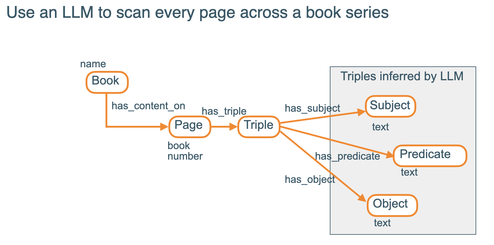
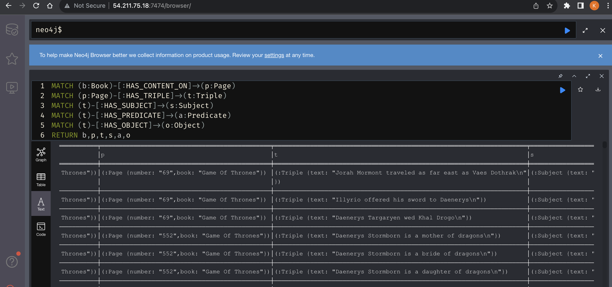

## Install docker and the docker compose plugin on EC2
```
sudo yum update -y
sudo yum install docker
sudo service docker start
sudo systemctl enable docker
sudo usermod -a -G docker ec2-user

sudo curl -L https://github.com/docker/compose/releases/latest/download/docker-compose-$(uname -s)-$(uname -m) -o /usr/local/bin/docker-compose
sudo chmod +x /usr/local/bin/docker-compose
```
## Start docker
```
sudo docker-compose up -d
```

## Ensure the docker container has access to the APOC core libraries 
```
docker exec -it game_of_thrones_neo4j bash 

root@8219d191653a:/var/lib/neo4j# cp ${NEO4J_HOME}/labs/apoc-5.13.0-core.jar ${NEO4J_HOME}/plugins
```
## Design of the Graph Database


## Populate the graph database with the triples
```
Change the URL and authn credentials in graph_creator.py

python graph_creator.py
```
## View all of the triples in a Neo4J database

